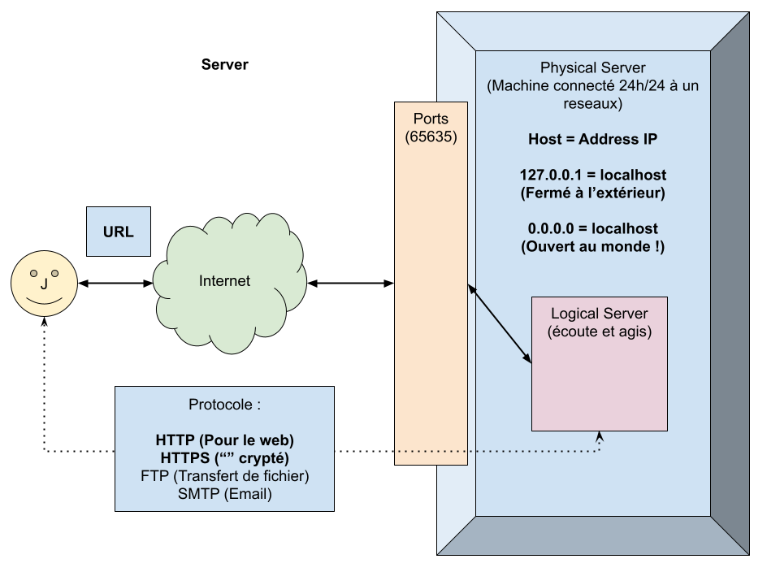
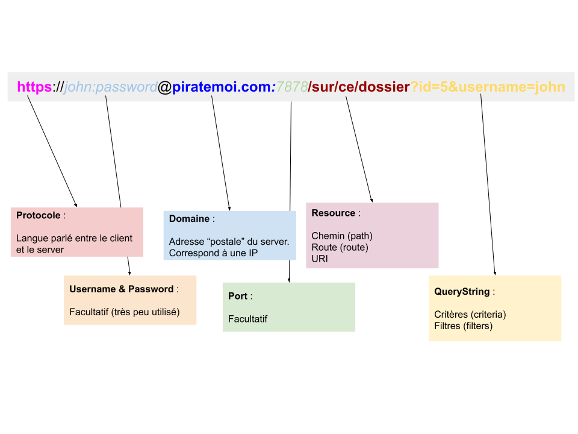
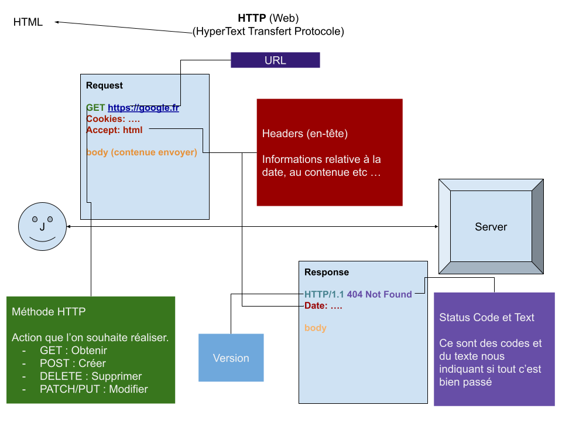

# Découvrir fastify

Fastify est une librairie nodejs permettant de créer des server logique HTTP.

## Les serveurs



## Les urls



## Le protocol HTTP



## Fastify

Nodejs à été conçu dans l'optique de créer des serveurs logique HTTP. Pour cela il existe plusieurs librairie :

- [**Express**](http://expressjs.com/) : La toute première librairie créé pour faires de serveurs HTTP en nodejs
- [**Fastify**](https://www.fastify.io/) : Plus récente et plus rapide, elle s'inspire d'express et supporte typescript, c'est celle que nous allons utilisé dans ce cours.
- [**NestJS**](https://nestjs.com/) : Framework complet basé sur le paradigm MVC, plus difficile d'accès mais bien plus complet !

### Installer fastify

Pour installer fastify :

```bash
npm i fastify
```

### Créer une application fastify

Afin de pouvoir créer notre premier server, nous devons créer une application fastify :

```ts
import fastify from 'fastify'

// Création d'une application fastify
const app = fastify()
```

### Lancer le serveur HTTP (listen)

Afin de démarrer notre serveur nous devons demander à notre application fastify d'écouter un port et un host :

```ts
// Écoute un port et un host
app.listen({ port: 5353, host: '127.0.0.1' }, () => {
  // Affiche un message dans la console nous indiquant que le serveur est démarré
  console.log("Le serveur http est prêt sur l'address : http://127.0.0.1:5353")
})
```

> ATTENTION : Il est fortement conseillé de mettre le port et le host dans des variales d'environements.

### Ajouter des routes

De base un serveur http ne fais rien du tout, pour ajouter des « actions » à notre serveur, nous allons devoir lui ajouter des route. Par éxemple je souhaiterais que mon serveur me dise bonjour :

```ts
// On utilise l'application fastify pour ajouter des routes. Chaque route possède une méthode HTTP et
// un chemin (Resource, Path) :
app.get('/', () => {
  return 'Bonjour les amis'
})
```

#### Les paramètres de routes

Il est possible en fastify de créer des routes dites "dynamique". Ce sont des routes qui accépte un ou plusieurs paramètre dans leur URI :

```ts
// Ici nous déclarons une route « dynamique ». Et nous devons spécifier via un générique
// le type des nos params :
app.get<{ Params: { name: string } }>('/bonjour/:name', request => {
  // Nous utilisons la request pour récupérer le contenu du paramètre
  // « name » :
  const name = request.params.name

  return `Bonjour ${name}`
})
```

Pour plus de lisibilité il est tout à fait possible de créer notre propre type :

```ts
/**
 * On déclare le type de nos params
 */
type SalutParams = {
  name: string
}

/**
 * On déclare la route :
 */
app.get<{ Params: SalutParams }>('/bonjour/:name', request => {
  // Nous utilisons la request pour récupérer le contenu du paramètre
  // « name » :
  const name = request.params.name

  return `Bonjour ${name}`
})
```

On peut aussi créer un type pour l'intégralité du générique :

```ts
/**
 * On déclare le type de nos params
 */
type SalutParams = {
  name: string
}

/**
 * On déclare un type pour notre route
 */
type SalutRoute = {
  Params: SalutParams
}

/**
 * On déclare la route :
 */
app.get<SalutRoute>('/bonjour/:name', request => {
  // Nous utilisons la request pour récupérer le contenu du paramètre
  // « name » :
  const name = request.params.name

  return `Bonjour ${name}`
})
```

Généralement la solution la plus répandu est un mélange des 2 solutions plus haut :

```ts
/**
 * Création d'un type pour notre route :
 */
type SalutRoute = {
  Params: {
    name: string
  }
}

/**
 * On déclare la route :
 */
app.get<SalutRoute>('/bonjour/:name', request => {
  // Nous utilisons la request pour récupérer le contenu du paramètre
  // « name » :
  const name = request.params.name

  return `Bonjour ${name}`
})
```

#### Les query string

Il est aussi possible de « typer » et manipuler des query string (filtres) :

```ts
/**
 * Création d'un type pour ma route salutation
 */
type SalutationRoute = {
  Params: {
    name: string
  }
  Querystring: {
    upcase?: boolean
  }
}

/**
 * On déclare la route :
 */
app.get<SalutationRoute>('/salutation/:name', request => {
  // Nous utilisons la request pour récupérer le contenu du paramètre
  // « name » :
  const name = request.params.name

  // On récupére le filtre "upcase"
  const upcase = request.query.upcase

  return upcase ? `Bonjour ${name}`.toUpperCase() : `Bonjour ${name}`
})
```

### Personaliser le status de réponse

Il est parfois essentiel que notre serveur retourne le bon status. Par éxemple le status `200 Ok` est utilisé lorsque tout ce passe bien, cependant si une erreur survient notre serveur doit répondre le bon status :

- `400` : Une erreur c'est produit côté client
- `500` : Une erreur c'est produit sur le serveur
- `404` : La page n'éxiste pas

Vous retrouverez la liste des stautus http ici :

[Liste des status HTTP](https://developer.mozilla.org/fr/docs/Web/HTTP/Status)

Pour personnaliser le status :

```ts
app.get('/test', (request, response) => {
  // Pour personnaliser le status, nous utilisons la réponse :
  response.code(400)

  return 'Une erreur est survenue'
})
```
