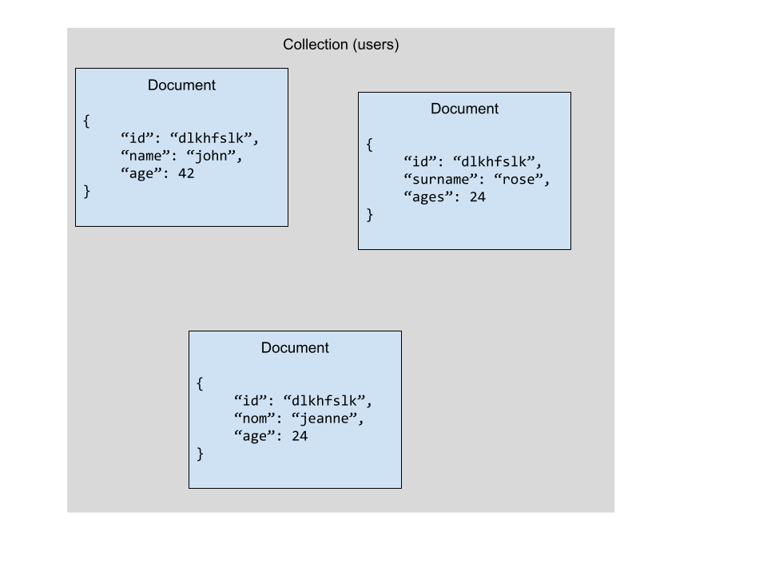

# Découvrir mongoDB

[MongoDB](https://www.mongodb.com/) est une base de données non relationnel, très rapide, ne possédant pas schèmas et natif en javascript.

## Le fonctionnement

MongoDB n'utilise pas de **table** mais des collection et des documents contenant un objet JSON :



## Installation

Il éxiste différentes méthode pour installer mongodb.

### 1. Le téléchargement et l'installation en local

Il est tout à fait possible de télécharger mongodb et de l'installer sur votre machine. Pour cela rendez-vous sur le site officiel :

[Téléchargement de mongo](https://www.mongodb.com/try/download/community)

### 2. MongoDB Atlas

C'est un service _cloud_ permettant de créer gratuitement des bases de données mongodb dans le monde entier. Il est gratuit jusqu'à certaines limite. La base de données non payante est limité resource.

En plus de fournir la base de données, il met à disposition une interface nous permettant de gérer nos données et des statistiques en temps réel !

[MongoDB Atlas](https://www.mongodb.com/atlas/database)

## Utiliser mongo db

Pour utiliser il faut tout d'abord installer un plugin fastify nous permettant de nous connécter :

```bash
npm i @fastify/mongo
```

Pout commencer à travailler avec mongodb, il faut initialiser une connection à la base de données en utilisant le plugin installé précédement :

```ts
import fastify from 'fastify'
import fastifyMongo from '@fastify/mongo'

/**
 * Création d'une application fastify
 */
const app = fastify()

/**
 * On initialize une connection à la base de données
 */
app.register(fastifyMongo, {
  // Nous devons spécifier l'url de connnection à la base de données
  url: '....',
})
```

> Pour obtenir l'url en utilisant mongodb atlas, cliquer dans la boite du cluster sur `connect` vous devez spécifier entre le `/` et le `?retryWrites` le nom de votre base de données. Il est conseillé de mettre le nom de la base de données ou l'url de connexion à mongodb dans le `.env`

Pour récupérer la base de donées ou vous le souhaiter il suffit de taper :

```ts
app.mongo.db
```

## Créer des documents dans une collection

Maintenant que nous possédons une connexion à notre base de données, il est très simple de créer un document dans une collection :

```ts
const result = await app.mongo.db.collection('pizzas').insertOne({
  name: 'margarita',
  prix: 12.5,
})

// Ici la constant result contiendra l'identifiant mongo de votre document :
result.insertedId
```

> Très important, vous devez lancer ce code dans une fonction `async`, assurez-vous aussi de typer en utilisant zod :

## Mettre à jour un document existant

Il est aussi possible d'utiliser notre base de données pour mettre à jour un document :

```ts
import { ObjectId } from '@fastify/mongo'

const result = await app.mongo.db.collection('pizzas').updateOne(
  {
    _id: new ObjectId('dskfhsdlfksdhlfksdhfsdhffsldkfh'),
  },
  {
    $set: {
      name: 'Regina',
    },
  },
)
// Ici la constante result contiendra l'identifiant de l'objet modifier
result.upsertedId
```

## Supprimer un document

```ts
import { ObjectId } from '@fastify/mongo'

const result = await app.mongo.db.collection<PizzaType>('pizzas').deleteOne({
  _id: new ObjectId('sdmhfldhdlskfhlkshflkdshfkfhsd'),
})
```

## Récupérer un ou plusier document

Pour récupérer un document (en utilisant son identifiant) :

```ts
import { ObjectId } from '@fastify/mongo'

const result = await app.mongo.db.collection<PizzaType>('pizzas').findOne({
  _id: new ObjectId('sdflkhsdlfksdhflksdhfsdkhf'),
})
```

> Nous pouvons aussi récupérer un document par l'un de ces champs :
>
> ```ts
> import { ObjectId } from '@fastify/mongo'
>
> const result = await app.mongo.db.collection<PizzaType>('pizzas').findOne({
>   name: 'Regina',
> })
> ```

### Récupérer plusieurs documents

Pour récupérer tout les documents d'une collection :

```ts
const documents = await app.mongo.db
  .collection<PizzaType>('pizzas')
  .find()
  .toArray()
```

#### Limiter les résultat

```ts
const documents = await app.mongo.db
  .collection<PizzaType>('pizzas')
  .find()
  .limit(10)
  .toArray()
```

#### Trier les résultats

```ts
const documents = await app.mongo.db
  .collection<PizzaType>('pizzas')
  .find()
  // 1 pour croissant, -1 pour décroissant
  .sort({ name: 1 })
  .toArray()
```

#### Utiliser un offset

```ts
const documents = await app.mongo.db
  .collection<PizzaType>('pizzas')
  .find()
  .limit(2)
  .offset(3)
  .toArray()
```

#### Filtrer les résultat en utilisant une Query

```ts
const documents = await app.mongo.db
  .collection<PizzaType>('pizzas')
  .find({
    // name === 'Vegan'
    name: 'Vegan',
  })
  .toArray()
```

```ts
const documents = await app.mongo.db
  .collection<PizzaType>('pizzas')
  .find({
    // name === tout ce qui commence par Reg
    name: /^Reg/,
  })
  .toArray()
```

```ts
const documents = await app.mongo.db
  .collection<PizzaType>('pizzas')
  .find({
    // name === tout ce qui contient Reg
    name: {
      $search: 'Reg',
    },
  })
  .toArray()
```

Vous pouvez aller plus loin avec toute une série d'opérateur pour vos query :

- [Opérateur de comparaison](https://www.mongodb.com/docs/manual/reference/operator/query-comparison/)
- [Opérateur logique](https://www.mongodb.com/docs/manual/reference/operator/query-logical/)
- [Opérateur sur les éléments](https://www.mongodb.com/docs/manual/reference/operator/query-element/)
- [Opérateur de traitement](https://www.mongodb.com/docs/manual/reference/operator/query-evaluation/)

## Utiliser toujours vos model Zod !

MongoDB ne posséde aucune **validation de données**. Afin d'éviter d'avoir des données incohérente (un utilisateur sans email, une pizza sans prix, un livre sans auteur etc ...) il faut absolument utiliser les Model zod :

```ts
// Création d'une pizza
const result = await app.mongo.db
  .collection<PizzaType>('pizzas')
  .insertOne(PizzaModel.parse({ name: 'Regina', prix: 12.5 }))

// Récupération d'une pizza
const pizza = PizzaModel.parse(
  await app.mongo.db
    .collection<PizzaType>('pizzas')
    .findOne({ _id: new ObjectId('dfkhsdlfksdhffkh') }),
)

// Récupération de plusieurs pizza
const pizzaList = PizzaListModel.parse(
  await app.mongo.db
    .collection<PizzaType>('pizzas')
    .find()
    .limit(10)
    .sort({ name: 1 })
    .toArray(),
)
```
