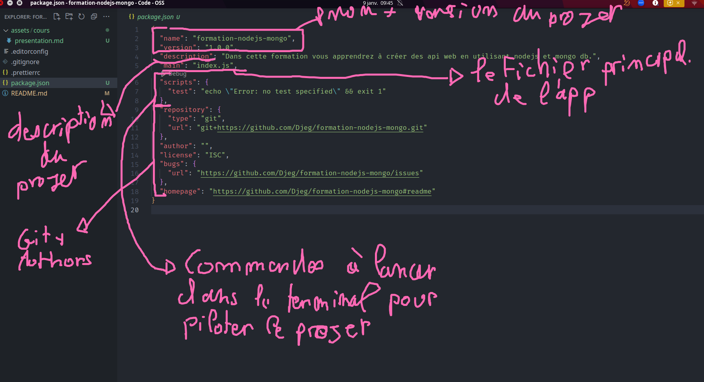
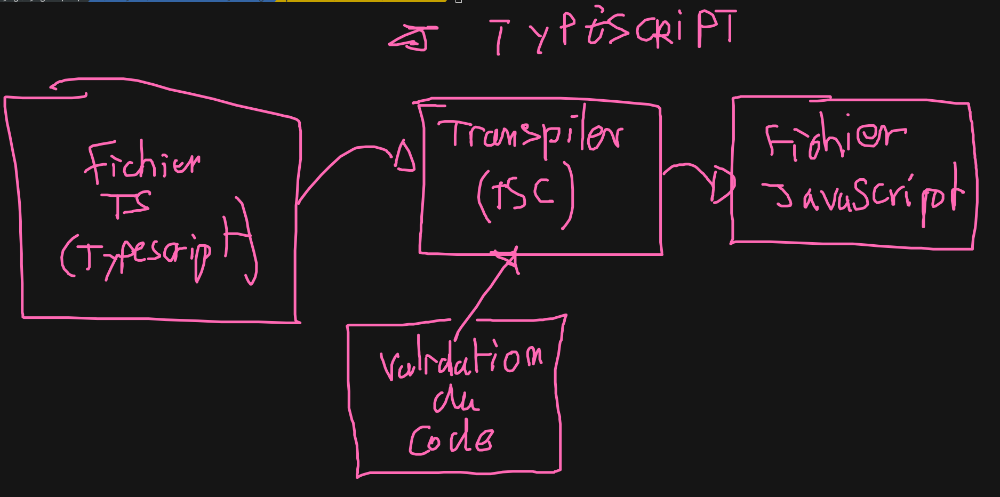

# Présentation & Installation

Pour commencer à développer en NodeJS il faut tou d'abord installer :

- node : Le compilateur (ou interpréteur)
- npm : Le package manager (chef d'orchestre)

Pour l'installation rien de plus simple, [rendez-vous sur le site officiel](https://nodejs.org/en/download/)

Pour s'assurer de l'instalation des 2 outils, il suffit d'ouvrir un terminal et de lancer
les commandes suivantes :

```bash
# Affiche la version de node (l'interpréteur)
node --version
# Affiche la version de npm
npm --version
```

## Commencer un projet

Pour démarrer n'importe quel projet nodejs, il faut tout d'abord générer un `package.json`. C'est un petit fichier qui contient toutes les inos de notre projet.

Pour créer ce `package.json` il faut utiliser la commande :

```bash
npm init
# Si vous ne souhaitez pas que nopm ous pose des questions
npm init -y
```

> Important : Il faut lancer cette commande uniquement au tout début du projet et dans un dossier vide de votre choix

## Anatomie d'un package.json



## Lancer un fichier javascript

Pour lancer un fichier javascript c'est très simple. Par éxemple, immaginons un fichier `index.js` à la racine du projet, pour le lancer il suffit de rentrer la commande :

```bash
node index.js
```

## Installer et configurer typescript

Pour pouvoir faire du typescript, il faut tout d'abord l'installer et le configurer sur notre projet. Pour cela demandons tout d'abord à installer typescript :

```bash
# Install typescript ainsi que les types pour nodejs
npm i -D typescript @types/node
```

Lorsqu'on éxecute la commande `npm i` nous installons une librairie sur notre machine. Cette commande, install la librairie dans le dossier `node_modules` mais, elle met aussi à jour notre projet (le fichier `package.json`)

> La petite option `-D` veut dire "développement". Il faut savoir que nous pouvons installer des librairies pour la production (des librairies qui seront utilisé sur le serveur final) et des librairies de développement (utilisable uniquement sur notre machine). Ici c'est la cas de typescript.

> Attention le dossier `node_modules` ne doit pas être versionné sur git !

### Configuration de typescript

Typescript est conçue pour faire du javascript. D'ailleurs c'est le même langage avec seulement l'ajout et le support des types. Puisque javascript s'utilise de plein de manière différente et bien nous allons devois configurer typescript avec nodejs.

Pour cela il faut la commande suivante pour créer le fichier de configuration de typescript :

```bash
# Créer le fichier de configuration typescript `tsconfig.json`
npx tsc --init
```

## Fonctionnement de typescript

Typescript est un **transpiler** javascript. C'est à dire son objectif est de produire du code javascsript avec moins de bug.



Pour transpiler un fichier typescript en fichier javascript, il faut utiliser la commande suivante :

```bash
# Transforme le mon/fichier.ts en mon/fichier.js
npx tsc mon/fichier.ts
```

## Configurer typescript pour compiler tout un projet

Pour cela on vas utiliser le fichier `tsconfig.json`. Dans ce fichier nous retrouvons des options nous permettant de définir comment un projet typescript doit se compiler en javascript.

Pour cela il faut, dans le fihier `tsconfig.json` décommenté et configurer les options suivantes :

- `"rootDir"` : Correspond au dossier contenant tout nos fichier typescript. Ce dossier c'est toujours **`src`**.
- `"outDir"` : Correspond au dossier qui contiendra les fichier javascript compilé par typescript.

Il suffit de lancer la commande suivante afin de compiler tout nos fichier typescript en javascript.

```bash
npx tsc
```

> Attention le dossier `outDir` (généralement dist) ne doit pas être versionné sur git !

## tsnode à la rescousse !

Il éxiste un outil bien plus simple pour lancer du code typescript. C'est `ts-node`. Il permet d'éxécuter directement du typescript comme du javascript (sans passer par l'étape de compilation).

Installer `ts-node` :

```bash
npm i -D ts-node
```

Maintenant nous pouvons éxécuter n'importe quelle fichier typescript comme si c'était du javascript avec la commande suivante :

```bash
npx ts-node mon/fichier.ts
```

> Attention : TSNODE est très très très gourmand en mémoire vive. Il ne doit surtout être utilisé sur le serveur de production.

## Créer ses propres commande `npm` !

**tout projet nodejs (même react ...) possède des commandes de pilotage**. L'idée est de proposer des commandes simples pour réaliser
toutes ces étapes.

Pour cela nous pouvons créer des commande `npm` depuis notre `package.json`. Pour cela il faut se rendre dans le section `scripts` du fichier `package.json` pour pouvoir créer nos propre commande :

```json
{
  //....
  "scripts": {
    "init:typescript": "tsc --init"
  }
}
```

Maintenant pour lancer notre commande npm, rien de plus simple :

```bash
npm run init:typescript
```

> Il éxiste 3 commandes fournie de base par npm : "start", "test" et "build". Ces 3 commandes sont obligatoire pour tout projet nodejs. La commande "start" démarre l'application, la commande "test" test l'application la commande "build" construit l'application. Pour ces 3 commande pas besoin de spécifier `run` juste après `npm`.
