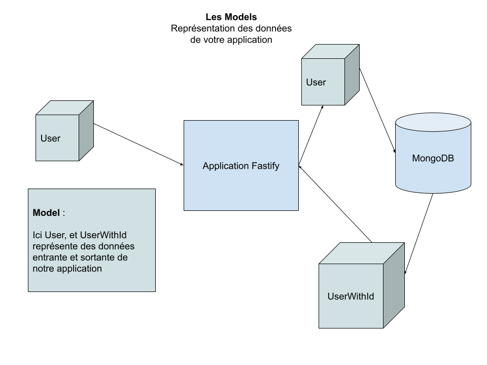

# Models, Shémas et Validation

Les models sont toutes les données entrante et sortante d'une application :



## Zod : Créer nos models

[zod](https://zod.dev/) est une librairie permettant de créer ses fameux model. C'est elle qui vas nous permettre de définir toutes les données de notre application.

Pour utiliser il nous faut installer la librairie ainsi qu'une petite extension pour supporter les schémas json :

```bash
npm i zod zod-to-json-schema
```

### Création d'un model

Un model est une sorte de contrat, ou de schéma utilisé afin de représenté une données de notre api. Prenons un exemple : un utilisateur !

Généralement, nos modeles si situe dans le dossier `src/models`

```ts
// src/models/users.ts
import { z } from 'zod'
import zodToJsonSchema from 'zod-to-json-schema'

/**
 * Grace à z, nous pouvons définir des models
 */
export const UserModel = z.object({
  id: z.string(),
  firstname: z.string().min(2),
  lastname: z.string().min(2),
  email: z.string().email(),
})

/**
 * Création d'un model pour un nouvelle utilisateur.
 *
 * Pour cela j'utilise le même que l'utilisateur sauf
 * que je lui retire l'id
 */
export const NewUserModel = UserModel.omit({ id: true })

/**
 * Convertir un model zod en type typescript.
 * Pour cela nous utilisons z.infer
 */
export type UserType = z.infer<typeof UserModel>

/**
 * Conversion du nouvelle utilisateur en type
 */
export type NewUserType = z.infer<typeof NewUserModel>

/**
 * Nous pouvons ausi convertir un model zod en un json schema.
 * Pour convertir un model en json schema rien de plus simple
 */
export const UserSchema = zodToJsonSchema(UserModel)

/**
 * Conversion du model en schéma
 */
export const NewUserSchema = zodToJsonSchema(NewUserModel)
```

Maintenant que nous possédons notre model, notre type et notre schéma nous pouvons utiliser tout cela en fastify :

```ts
// src/routes/users.ts
import { NewUserType, NewUserModel } from '../models/users'

/**
 * Création du plugin des utilisateurs
 */
export default async function userRoute(app: FastifyInstance) {
  /**
   * Création d'un route permettant de créer un nouvelle utilisateur
   */
  app.post<{ Body: NewUserType }>('/users', async (request, reply) => {
    // Pour lancer la validation avec zod :
    const { error, data: newUser } = NewUserModel.safeParse(request.body)

    // Si il y a une erreur
    if (error) {
      reply.code(400)

      return error
    }

    console.log(newUser) // { email: '...', firstname: '', lastname: '' }

    // Enregistrement en base de données ...
  })
}
```

## Les schémas

Fastify est conçu pour être extrémement rapide (Top 10 des librairie http les plus rapide). Pour réaliser ces performances il utilise des schèmas. Ces derniers sont utilisé pour optimisé et valider toutes les données qui rentre et qui sorte de notre api.

Sans ces shémas, fastify n'est pas très concurrent.

Pour utiliser ses schémas il nous faut passer des options à notre route. Dans ces options nous pouvons « schématiser » toutes les données entrantes et sortante de notre api :

- Le `request.body`
- Les `request.params`
- Les `request.query`
- Les `request.headers`
- Le retour de nos fonctions !

Pour schématiser toutes ces données :

```ts
// src/routes/users.ts
import {
  NewUserType,
  NewUserModel,
  NewUserSchema,
  UserSchema,
} from '../models/users'

/**
 * Création du plugin des utilisateurs
 */
export default async function userRoute(app: FastifyInstance) {
  /**
   * Création des options permettant de schématiser notre route
   */
  const newUserOptions = {
    schema: {
      // On définie le schéma du body
      body: NewUserSchema,
      // On définie le schéma du retour de la fonction
      response: {
        // Lorsque tout ce passe bien
        200: UserSchema,
      },
    },
  }

  /**
   * Création d'un route permettant de créer un nouvelle utilisateur
   */
  app.post<{ Body: NewUserType }>(
    '/users',
    newUserOptions,
    async (request, reply) => {
      // Pour lancer la validation avec zod :
      const { error, data: newUser } = NewUserModel.safeParse(request.body)

      // Si il y a une erreur
      if (error) {
        reply.code(400)

        return error
      }

      console.log(newUser) // { email: '...', firstname: '', lastname: '' }

      // Enregistrement en base de données ...
    },
  )
}
```
